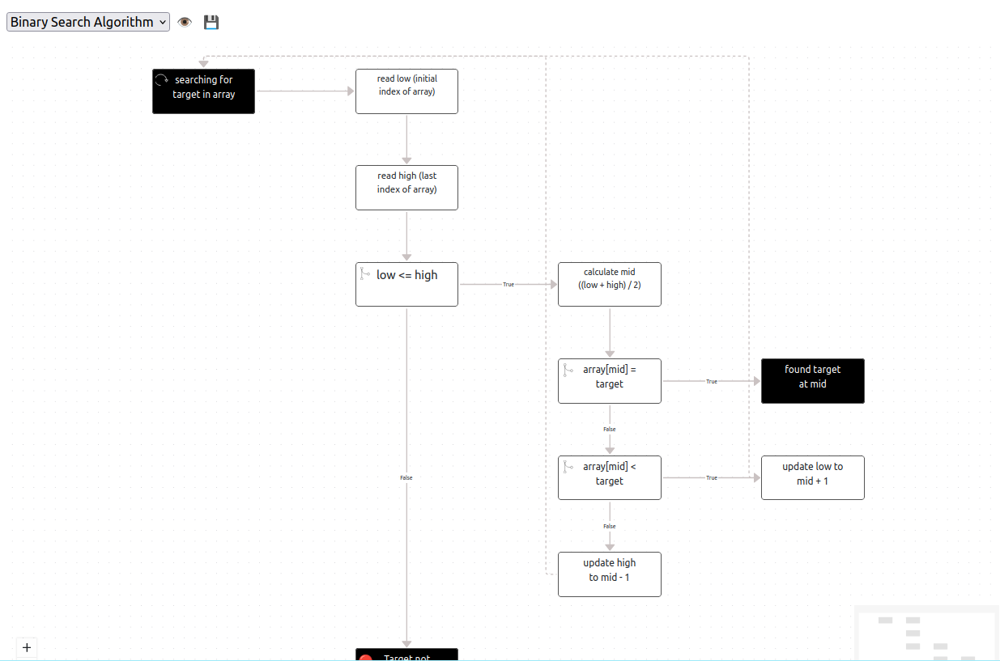

# Text2Chart

With respect to all existing text-to-diagram libraries, `@solothought/text2chart` library shares a similar purpose: building diagrams from text. By using text-based inputs, you gain the advantage of version control, enabling you to track changes, integrate with approval cycles, and share diagrams without concerns about file size.

Our library adds a unique focus on interactivity, creating diagrams that remain manageable and navigable as they expand. Currently, we’re launching FlowChart and have plan to add more type of diagrams on your feedback and requests. Follow and bookmark our GitHub repository to stay updated on new diagrams and enhanced features.

Currently, this library only supports generating flow chart. The supported format can be found at [@solothought/text2obj](https://github.com/NaturalIntelligence/text2obj) which is used a core dependency for parsing text to intermediate object that helps to draw charts.

<iframe src="https://github.com/sponsors/solothought/card" title="Sponsor solothought" height="225" width="600" style="border: 0;"></iframe>

Install
```
$ npm install @solothought/text2chart
```

Import
```
import { FlowChart } from '@solothought/text2chart';
import FlowChart from '@solothought/text2chart/flow';
import FlowChart from '@solothought/text2chart/FlowChart.svelte';
import '@solothought/text2chart/style.css';
```

Use
```
<script>
import FlowChart from '@solothought/text2chart/flow';
import '@solothought/text2chart/style.css';

  const text = `
    FLOW: passed as parameter
    here you go
    IF go in loop
      LOOP until
        you're safe here even with a long sentence
    finsh here`;

</script>
  
<FlowChart {text} />
```
or
```
import FlowChart from '@solothought/text2chart/FlowChart.svelte';
//...
new FlowChart({
  target: document.getElementById("chartEl"),
  props: {
    text: algoText,
  }
});
```
or
```
const FlowChart = require('@solothought/text2chart/flow');

new FlowChart({
  target: document.getElementById("chartEl"),
  props: {
    text: algoText,
  }
});
```

**Properties**
- `text`: This is an important property that contains your algorithm which is parsed and charted.
- `selection`: This is an object of `{flowIndex: number, nodeIds: number[]}` type. `flowIndex` is used to load the chart for a particular flow when multiple flows are given in input algorithm. `nodeIds` is used to highlight nodes of given Id.

