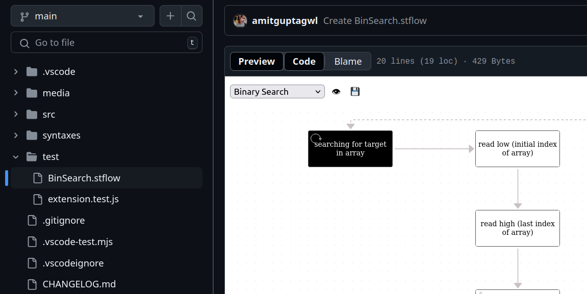

# Text2Chart Github Preview

This plugin detects when a file ending in .stflow is opened on GitHub. When such a file is detected, a 'Preview' button is added to the interface. Clicking this button will display a flowchart generated from the .stflow file’s contents, allowing you to visually interpret the file's flow.

The plugin is designed to remain stable and does not require updates unless GitHub’s page structure changes.

Note: graph contents are loaded from https://solothought.com. So please ensure, you have the access to the site.

Domains supported;
- github.com

**Important links**
- [stflow syntax](https://github.com/NaturalIntelligence/text2obj)
- [Text2Chart](https://github.com/solothought/text2chart)
- [Request or Report](https://github.com/solothought/text2chart)

**Troubleshooting**
If you see a blank white screen in preview window
- please click on "code" button first then click on "preview" button.
- please ensure that ".stflow" has valid algorithm as per latest syntax.

**Screenshots**

